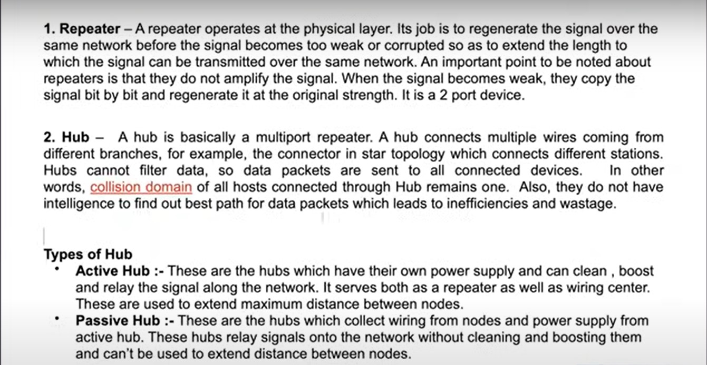
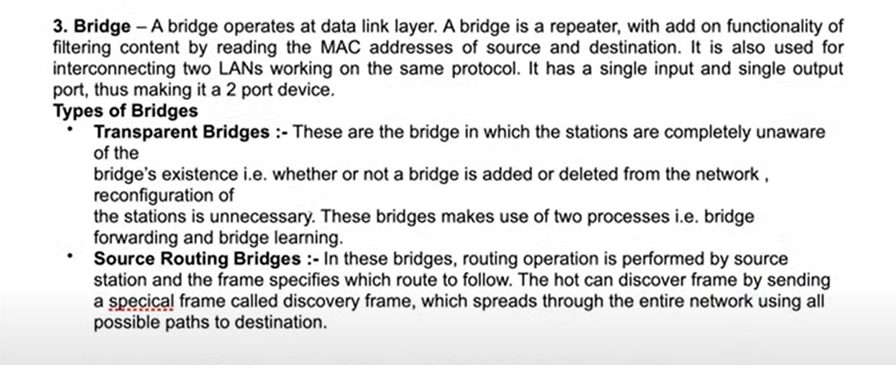
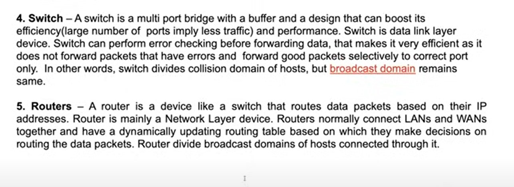
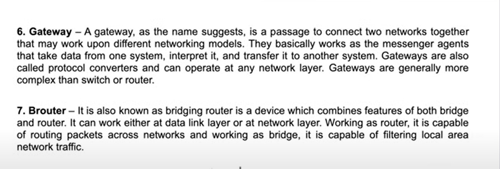

# Important Point from IP addresses :
IPv4 and IPv6 addresses can be generated by a modem or router using DHCP (Dynamic Host Configuration Protocol).

# Important Point from Port numbers.
In networking, every application or service running on a device uses a port number to ensure that data is delivered to the correct application.

# Important point from networking devices :

 

 

 

 
Modem: Connecting to your ISP and converting signals for internet access.
By itself, a modem usually connects to one device only (e.g., a single computer).
 
Routers have a global (public) IP address assigned by the Internet Service Provider (ISP), and this address is used for communication with servers on the internet. 
 
When the server sends the response to the router's global IP address then
the router uses Network Address Translation (NAT) to forward the data to the correct device in your local network.
 

# LAN , MAN , WAN 
Example of LAN : Home wifi router, office wifi router.
 
Example of MAN : Public Wifi Network provided across a city and local ISP's.
 
Example of WAN : Optical fibres and large ISP like TaTa ISP.

# Public and Public ip address :
Routers have assigned public ip address by the ISP. 
 
Our Cellular phones have private ip address by CGNAT (Carrier-Grade Network Address Translation) used by mobile carriers and if we connected to wifi. It also assigns private ip addresses using DHCP. 

# RFC 
It stands for request for comment.
RFC documents contain technical specifications and organizational notes for the Internet and are the core output of the IETF. 
 
More information : https://www.ietf.org/process/rfcs/

# Wireshark 
It is packet sniffing and packet capturing tool. 
Sniffing means finding and analysing the data packet which is being transfered or received and know more details about it. 

# ICMP :
Internet Control Message Protocol (ICMP) is used for reporting errors and performing network diagnostics.

# SONET 
It is a standardized digital communication protocol used to transmit large amounts of data over optical fiber networks. SONET is primarily used in telecommunications and allows the simultaneous transmission of multiple digital streams, ensuring high-speed data transfer and efficient bandwidth utilization.
 

Bandwidth is the maximum amount of data that can be transmitted over a network connection or communication channel within a specific period of time, typically measured in bits per second (bps).

# Frame relay :

Frame Relay is a wide-area network (WAN) technology that enables the efficient transmission of data between devices across a network. It is based on packet-switching, where data is divided into small, variable-sized units called frames and sent over virtual circuits(paths for consistent communication).
 
Frame Relay Switches: It is one of the device which is 
Operated by the service provider within their network infrastructure.
Responsible for routing frames across the network using virtual circuits

# Flow Control 
Flow control refers to a technique in data communication that ensures the sender and receiver operate at compatible speeds, so the receiver is not overwhelmed by data it cannot process in time. 

# MAC Addressing :
A MAC (Media Access Control) address is a unique identifier assigned to a network interface controller (NIC) for communication on a physical network. It is used in the Data Link Layer of the OSI model to ensure devices can be uniquely identified within a local network.
 
When a device knows another device's IP address but not its MAC address, it uses ARP(Address Resolution Protocol) to map the IP to the corresponding MAC address.
 
A computer's Wi-Fi and Bluetooth adapters have different MAC addresses because each network interface controller (NIC) in a device is assigned its own unique MAC address.

#  BitTorrent 
It is a prime example of a Peer-to-Peer (P2P) architecture, where devices (peers) communicate directly with each other without relying on a centralized server for data exchange.

# SSL 
SSL/TLS is often associated with the Session Layer because it establishes, manages, and terminates secure sessions between devices.
 

# Ephemeral ports 
These are temporary ports assigned by a computer's operating system to a client application for the duration of a communication session when several tabs of a single application like Chrome. These ports are used for outbound connections and are automatically allocated from a predefined range when needed.

# TCP 
TCP (Transmission Control Protocol) establishes a reliable connection between a client and a server before transferring data.

# Third-party cookies
Third-party cookies are cookies created by domains other than the website you are currently visiting. These cookies are commonly used for tracking users across websites, enabling targeted advertisements, analytics, and social media functionalities.
 
Example:
 
You visit example.com (first-party site).
The page includes an ad or tracking script from adnetwork.com.
A cookie from adnetwork.com is stored in your browser, tracking your activities across other websites that also load adnetwork.com.

# socket
A socket is a software abstraction that facilitates communication between two programs, typically over a network. It acts as an endpoint for sending and receiving data across a network or within the same machine.
 
A socket is defined by a combination of:
IP Address: Identifies the host or device.
Port Number: Identifies the specific application or service on the host
 
When a socket is created, it can either:
Use a specific port number explicitly provided (e.g., binding to port 80 for HTTP).
Allow the OS to assign a random available port if no specific port is provided.

# Multiplexing and Demultiplexing at Transport layer :
Multiplexing (Sender-Side)
Multiplexing refers to combining data from multiple processes or sources into a single communication stream for transmission to the server.
 
How It Works:
 
The sender (usually a client) has multiple applications or processes that need to communicate with the server.
Each application is identified by a port number.
The transport layer (e.g., TCP or UDP) attaches a port number to each application's data, creating a unique identifier for the data (e.g., <source IP>:<source port>).
Data from multiple applications is combined and sent over the shared network.
 
Example:
A web browser (using port 80 for HTTP) and an email client (using port 25 for SMTP) both send data over the same network connection. The transport layer adds port numbers to differentiate the data.
 
<b>2. Demultiplexing (Receiver-Side)</b>
Demultiplexing is the reverse process of multiplexing: the server separates the received data and delivers it to the appropriate application based on its port number.
 
How It Works:
 
The server receives the combined data stream.
The transport layer examines the destination port number in the header of each data packet.
Based on the port number, the data is delivered to the corresponding application or process running on the server.
 
Example:
The server receives a packet for port 80 (web server) and another for port 25 (email server). It routes the packets to the respective applications.

# Important point from duplex :
Simplex : only from one end, data can be sent  like : Radio FM. 
 
Half Duplex : Data can be sent from both side but only one at one time like 
Woky toky. 
 
Full Duplex : Data can be sent from both device simultaneousaly from both side like real time application.
 
Pager is the first device which is used to send the text data. 

# Congestion Control 
Congestion control is a mechanism used in computer networks to prevent or mitigate network congestion, which occurs when too much data is sent over a network, leading to performance degradation such as packet loss, delays, or reduced throughput.

# Important Point from Network Layer : 
In dynamic Routing, Dijkstra Algorthm is used to find the shortest path.
 
Hop by Hop things happens on the ISP.
 
Routing Table contains the block of addresses which are assigned to the ISP.
 
Internet Society creates Classes for IP addresses.
 
IETF(Internet Engineering Task Force) : It provides the IP addresses to ISP based on the regions not on the classes.

# Important point from Stateful Firewalls(a type of Middle Box) :
It stores similar data packets in the cache memory which can be allowed or denied.
 
Network Address Translator (NAT) typically exists on the boundary router or gateway device that connects a local (private) network to the public internet. 
 
NAT serves several important purposes:
 
1. Conservation of IPv4 Addresses
IPv4 has a limited number of addresses (approximately 4.3 billion), which is insufficient for the growing number of devices.
 
NAT allows multiple devices on a private network to share a single public IP address, significantly reducing the number of public IPs required.
 
2. Private IP Addressing
NAT enables devices using private IP addresses (e.g., 192.168.x.x, 10.x.x.x, 172.16.x.x) to communicate with devices on the public internet.
 
These private IP addresses are not routable on the internet and must be translated to a public IP address.
 
3. Security
NAT provides a basic level of security by hiding internal network details. External devices only see the public IP address of the NAT device, not the internal private IP addresses.
This reduces the attack surface for devices within the private network.
 
4. Load Balancing
NAT can distribute incoming traffic across multiple servers or devices, enabling load balancing.
For example, in port forwarding, NAT maps external requests to specific internal devices or services.
 

# Important Point from Data Link Layer :
ARP (Address Resolution Protocol) is a communication protocol used to map an IP address (logical address) to a corresponding MAC address (physical address) within a local network.
 
In a local network (e.g., Ethernet), devices use MAC addresses to communicate at the hardware level. However, applications and protocols (e.g., TCP/IP) rely on IP addresses to identify devices. ARP resolves this discrepancy by finding the MAC address associated with a specific IP address.
 
How Does ARP Work?
 
Broadcast Request:
When a device wants to communicate with another device in the same local network but only knows the target's IP address:
 
It sends an ARP Request packet to all devices on the network (broadcast), asking, "Who has this IP address?"
ARP requrst packet contains MAC Address of sender, IP address of destination which is called frame.
 
Unicast Reply:
The device with the requested IP address responds with an ARP Reply containing its MAC address.
 
Cache the Result:
To reduce future broadcasts, the device stores the resolved MAC address and IP address mapping in its ARP cache for a short time.
 
Example: 
 
If the router knows the destination IP address of the target device (assigned by the DHCP server).
If the router does not have the corresponding MAC address in its ARP cache, it sends an ARP request on the local network:
The ARP request asks, "Who has this IP address?"
The target device replies with its MAC address (ARP response)
 

# In 3G, 4G and 5G and 6G :
Thee major difference is bandwidth or we can say the difference in the range of their frequency. 

# Physical Layer 
There are two ways to transfer the data from router/modem to your computer/laptop or mobile . 
1. wireless : radio waves are used in the wireless. 
like : TV signal and FM radio. 
 
2. Wired : There are two types of wire. 
 
(i) Coaxial : It is used in wire connect your antena to your TV. 
 
(ii) UTP/STP : It is used in Ethernet cables. It can be shielded or unshielded. 
 
(iii) Optical Fibre : It is used for transfer the data to far places like optical fibres are submerged under the water to connect one country to another. 

# Cellular Network :
A wide-area wireless communication system that uses cell towers (base stations) to provide network access to mobile devices over licensed radio frequency bands.
 
A cell is a geographical area covered by a base station's radio signals.

# Wifi: Wireless-Fidelity :
A local-area wireless networking technology that allows devices to connect to the internet or communicate with each other over unlicensed frequency bands.

# UE and RAN 
UE means User Equipment. UE refers to the devices that connect to the cellular network. Examples:

Mobile phones
Tablets
Laptops with cellular connectivity
IoT devices with cellular modems (e.g., smart meters, smartwatches)
 
RAN : It stands for Radio Access Network. RAN is the part of the cellular network that connects UE to the core network using radio signals.
 
Components:
 
Base Stations: Known as eNodeB in 4G or gNodeB in 5G. These manage radio communication with UE.
 
Antennas: Facilitate the transmission and reception of radio signals.
 
Backhaul Links: Connect the base stations to the core network.

# Evolution in 5G
UE: 5G UEs are designed to support higher frequencies (mmWave), advanced modulation schemes, and multiple antennas for better performance.
 
RAN: 5G RAN introduces concepts like Cloud RAN (C-RAN) and Open RAN (O-RAN), which virtualize and open up the RAN architecture for greater flexibility and interoperability.

# References :
github.com/Kunal-Kushwaha/DevOps-Bootcamp